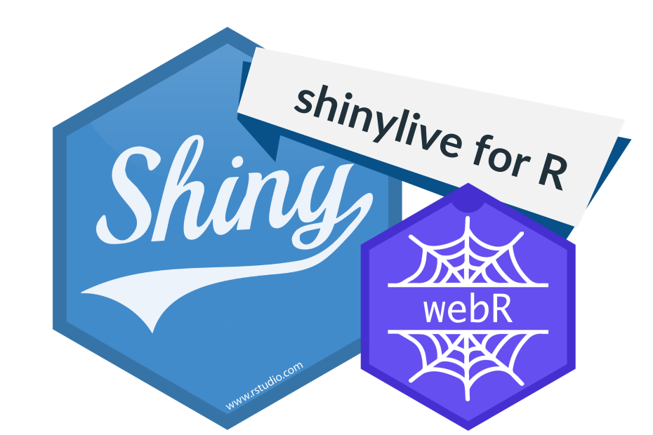

# All About Shiny Live

{width="300"}

## A Better Way of Doing Things – Serverless Computing with Shiny Apps

If you have any experience with Shiny, then you probably know that normally, Shiny apps are deployed on a central server, such as Posit Connect or your self-coded server. App users engage with the application through their web browsers, but the app's R session and computations are still performed only on the server. As a result, the server becomes the one that has to do all the calculations, which consequently makes the app operate slowly and overload the server with every increase in popularity or high traffic.

## What are the Shiny Live and its Concepts?

Shiny Live resembles a novel strategy that alters the norm of doing Shiny apps by placing the R session directly in the user's browser. This serverless architecture means that the application will not communicate with any server for backend support or processing; all computations will be handled locally within the user’s browser. People can communicate with the app using only one page load, and it will still update it instantly. As a result, the update will no longer involve the back and forth communication with a remote server. It is done through the shiny live export feature, which bundles the app code into a folder that can be hosted on the GitHub Pages. The user simply has to visit the app’s web address (URL), and then she must wait a little while for it to load. After warding off the start, the user can immediately start working with the app.

## How does Shiny Live differ from the traditional shining apps?

The conventional Shiny program is an instance where R code is executed on a server, and most computations and data manipulations take place there. The server processes this info and sends it to the user's browser as an interactive webpage. This implies that when various requests are placed on the app at the same time, the server gets to be the only one performing all the app functions, and in situations where the server is unable to meet the demand, the request leads to slowness and sometimes even crashes.

On the other hand, Shiny Live uses the user’s laptop CPU for R session processing instead of the server, which means the entire app will be based on the capabilities of their browser. Users don't require anything offline. All they need to do is navigate through a URL online. The app performs all calculations offline, and there’s not anything that could result in a server with too many users in this situation. There are no special settings to be done off the concurrent file system – GitHub Pages provides them freely.

## Advantages and Disadvantages of Shiny Live in Contrast to Regular Shiny Apps

### Shiny Live Pros:

-   Serverless Hosting: Live Shiny's biggest benefit is it doesn't require in-house infrastructure to run the app. This allows you to test ideas or simple applications without a heavy server, which could be expensive and demanding.

-   Potential for increased user base: Since the computations are done in the browser, Shiny Live apps do not have throughput limitations because of server workload abilities. As a qualification requirement, users only need to have up-to-date browsers.

-   Reduced Costs: Because you do not need a server to run the app, the cost of deploying the app is almost zeroed. You can host the app on platforms such as GitHub Pages, causing a major advantage for small projects or academic feasibility studies.

-   Immediate Availability: People don’t need to run or install any software, i.e., R or RStudio, on their computers. A converse attitude is evinced – they just click on the URL and interact with the app directly in their browser.

### Shiny Live Cons:

-   Processing Limitations on Client-Side: Given the nature of using Shiny Live, it may not be the right tool for apps with significant computations that require intensive algorithms or large datasets. If the app consists of multi-stage analysis, then traditional Shiny may still be used.

-   Stringent Data Privacy: The typical Shiny app has R codes, data and everything sent to the user side. In this case, sensitive data cannot be handled properly because users have broad access to codebase. For the confidential information, the security will be guaranteed more on the server-side process.

-   Restricted Dependencies: Currently, Shiny Live has constraints on particular R packages, for instance, one which uses system libraries such as curl. These packages will not function perfectly in Shiny Live apps to make it a little bit less flexible in employing some use cases.

-   Excel icon at work: The load time on Shiny Live apps is fairly quick, but there will still be a 5-second wait for the app to load fully and get started in the browser. Nevertheless, this is substantially lower than before and can be viewed by some users as the only disadvantage.

## Final Remarks:

Shiny Live points to a turning point in our conceptions of deploying Shiny applications. Due to the move from server to clients' browsers, Shiny Live implies easier, faster as well as serverless deployment. It suits those apps that are small, lightweight and without any data security involving complicated calculations. As for other resource-demanding or safety-persistent applications, traditional Shiny coding with server side computations may indeed remain the best option. With the progress of Shiny Live, the object can become a helpful instrument for quick launching of dynamic applications with no-server environments.
